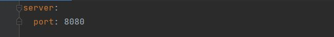
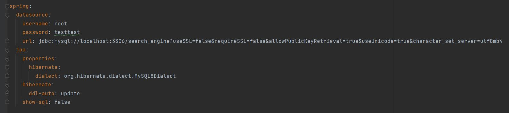
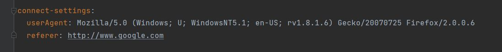
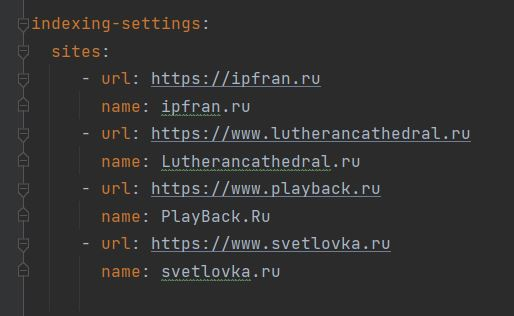

<h1 style="text-align: left;">Searchengine</h1>

Данный проект реализует поисковый движок, предоставляющий пользователю специальный API со следующими основными функциями:

<ul>
<li>предварительное индексирование сайтов;</li>
<li>выдача основных сведений по сайтам;</li>
<li>поиск ключевых слов в проиндексированных сайтах и предоставление их пользователю.</li>
</ul>

<h2>Стэк используемых технологий</h2>

Spring Framework, JPA, JSOUP, SQL, Morphology Library Lucene

<h2>Файл настройки</h2>

Настройки запуска приложения, настройки подключения к СУБД (в данном случае MySQL) и список сайтов для индексации указаны в файле <strong><em>&nbsp;application.yaml</em></strong>

<h3>Раздел server</h3>

В этом разделе задаётся параметр <em>port</em> &mdash; порт, через который контроллеры&nbsp;приложения "слушают" веб-запросы. Задавая разные порты, можно, например,&nbsp;из разных папок, в которых находятся файлы настройки, запустить несколько&nbsp;экземпляров приложения.

<h3>Раздел spring</h3>

Здесь задаются параметры для подключения к СУБД (логин, пароль, строка подключения и параметры Hibernate для работы с СУБД).

Внимание! Базу данных необходимо создать используя&nbsp;кодировку&nbsp;<strong>utf8mb4</strong>

<h3>Раздел connect-settings</h3>

Здесь задаются параметры <strong>userAgent</strong> и <strong>referer</strong>&nbsp;соединения для получения контента веб-страницы

<h3>Раздел search-settings</h3>

Здесь&nbsp;задаются параметры, которые используются при&nbsp;поиске информации&nbsp;(по API-запросу<strong> /api/search</strong>):

<ul>
<li>
<strong>sortByAbsoluteRelevance: true</strong> (default) 
<pre>если true - то выводит список найденных страниц отсортированных по Абсолютной релевантности если false - то по Относительной релевантности</pre>
</li>
<li>
<strong>onlyFirstNormalWord: true</strong>  (default) 
<pre>если true - то берет только первую нормальную форму слова в качестве леммы для поиска если false - то берет все нормальные формы слова в качестве леммы для поиска</pre>
</li>
<li>
<strong>percentFilteredLemmas: 75</strong>  (default) 
<pre>процент для исключения из полученного списка леммы, которые встречаются на
слишком большом количестве страниц&nbsp;</pre>
</li>
</ul>
<h3>Раздел indexing-settings</h3>
<h4>подраздел sites</h4>

Список сайтов для индексации.

<h2>Веб-интерфейс</h2>

В проект входит веб-интерфейс, который позволяет управлять процессами, реализованными в движке.

Веб-интерфейс (frontend-составляющая) проекта представляет собой&nbsp;одну веб-страницу с тремя вкладками:

<h3>Вкладка DASHBOARD</h3>

Эта вкладка открывается по умолчанию. На ней&nbsp;отображается общая статистика по всем сайтам, а также детальная статистика (количество лемм и проиндексированных страниц каждого сайта) и статус по каждому из сайтов (статистика, получаемая по&nbsp;запросу <strong>/api/statistics</strong>).

<h3>Вкладка MANAGEMENT</h3>

На этой вкладке находятся инструменты управления поисковым сервисом &mdash; запуск кнопка "<strong>Start Indexing</strong>" (запрос <strong><em>/startIndexing</em></strong>) и остановка кнопка "<strong>Stop Indexing</strong>"&nbsp;(запрос <strong><em>/stopIndexing</em></strong>) полной индексации (переиндексации), а также возможность добавить (обновить) отдельную страницу указанную в поле "<strong>Add/update page:</strong>" (указать её url, начиная с http://)&nbsp;кнопка "<strong>ADD/UPDATE</strong>"&nbsp; (запрос <strong><em>/indexPage/{pagePath}</em></strong>).

При запуске полной индексации, в случае, если сайты уже были проиндексированны раннее, произойдет полное удаление всех данных сайтов - страниц, лемм и индексов, которое может занять продоложительное время.

После старта процесса индексации из файла конфигурации извлекаются данные по сайтам (url,name) и в рекурсивном обходе по ссылкам происходит поиск и скачивание содержимого страниц.

При запуске индексации отдельной страницы, указанной в поле "<strong>Add/update page:</strong>"&nbsp; по нажатию на кнопку "<strong>ADD/UPDATE</strong>", сервис проверяет принадлежит ли эта страница какому-либо сайту, указанному в файле конфигурации (раздел "<strong>indexing-settings</strong>"). Если страница не принадлежит, то будет выдана соответствующая ошибка, если принадлежит, то будет запущена индексация только этой страницы, причем если она была проиндексирована раннее, то&nbsp;сначала будут удалены все индексы, частота лемм будет уменьшена, и эта страница будет удалена из базы данных. В процессе индексации будет добавлена страница, леммы и созданы новые индексы.&nbsp;

<h3>Вкладка SEARCH</h3>

Эта вкладка предназначена для поиска слов по уже проиндексированным сайтам. На ней находится поле поиска и выпадающий список с выбором сайта, по которому надо искать, или искать по всем сайтам, а при нажатии на кнопку "<em><strong>SEARCH</strong>"</em> выводятся результаты поиска (по запросу <strong>/search</strong>).

&nbsp;Вы можете указать одно, два или несколько слов. Поиск не учитывает междометия, союзы, предлоги и частицы. 

